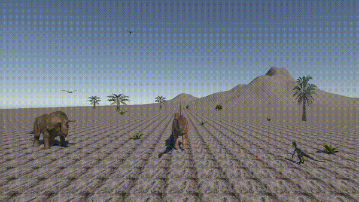
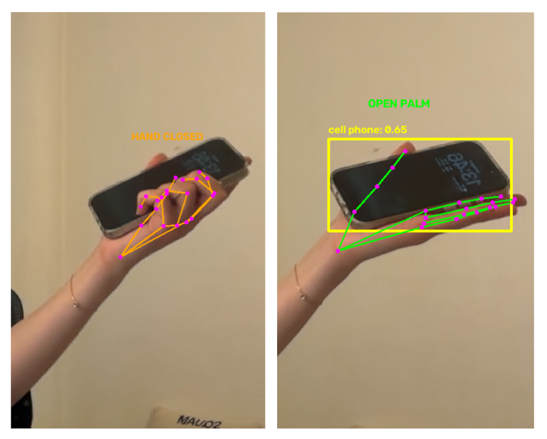

# ECaurus

Feed the dinosaur objects in an open palm and it will walk towards you. It will find the direction you are in the camera view and move accordingly. 

Works via  python computer vision pipeline that detects objects and hand gestures, then sends the result to Unity over UDP. 



When the palm is closed, the dinosaur knows it is not being fed. When the palm is open, detection is activated. 



## How it works

1. **Python** captures webcam frames and runs two models in parallel:
   - **YOLO11s** — detects objects in the frame
   - **MediaPipe Hand Landmarker** — tracks hand pose and detects open palms
2. When an object is near an open palm for 5 consecutive frames, it is considered "presented"
3. The label and horizontal offset (turn degrees) are sent as a JSON UDP packet to Unity
4. **Unity** receives the packet, and the dinosaur turns toward the object and reacts

## Project structure

```
InteractiveDinoPython/   # Python vision pipeline
  main.py                # Entry point — webcam loop, drawing, selection logic
  detector.py            # YOLO object detection wrapper
  hand_tracker.py        # MediaPipe hand tracking wrapper
  udp_sender.py          # Sends JSON over UDP to Unity
  models/                # Model files (not committed — see below)

Assets/Scripts/          # Unity C# scripts
  DetectionReceiver.cs   # Listens on UDP port 5052, dispatches messages
  DinosaurReaction.cs    # Animates the dinosaur's turn and reaction
```

## Setup

### Python

Requires Python 3.11 and a webcam. Runs on Apple Silicon (uses MPS device).

```bash
cd InteractiveDinoPython
conda create -n dino-env python=3.11
conda activate dino-env
pip install -r requirements.txt
```

Download the model files and place them in `InteractiveDinoPython/models/`:
- `yolo11s.pt` — [Ultralytics YOLO11s](https://docs.ultralytics.com/models/yolo11/)
- `hand_landmarker.task` — [MediaPipe Hand Landmarker](https://ai.google.dev/edge/mediapipe/solutions/vision/hand_landmarker#models)

### Unity

Open the project in Unity (6000.x or later). The `DetectionReceiver` component listens on UDP port `5052` on localhost. Hit Play while the Python script is running.

## Running

```bash
cd InteractiveDinoPython
python main.py
```

Press **Q** to quit. A 3-second cooldown prevents repeated triggers.

## UDP message format

```json
{ "label": "cup", "turnDegrees": -24.5 }
```

`turnDegrees` is clamped to ±60° and represents the horizontal offset of the detected object from screen center.


## 3D Asset Credits

- **Diplodocus** — model by CGreature / kenchoo, via [Sketchfab](https://sketchfab.com/3d-models/diplodocus-157b9b7eaef74f44bf4a5d3b986a5b9c).

- **Triceratops** — rebuilt and animated by kenchoo, based on "Triceratops-JWE" by JW Roberta, via [Sketchfab](https://sketchfab.com/3d-models/triceratop-4425e68c2d8648e79159dc00ddeddf77). Licensed under [CC BY 4.0](https://creativecommons.org/licenses/by/4.0/).

- **Animated JWR Velociraptor** — animated by Gisduyg, based on a model by jimmyho905, via [Sketchfab](https://sketchfab.com/3d-models/animated-jwr-velociraptor-58f160a58bfc48bb95bcbfa1ece2a0b2). Licensed under Creative Commons Attribution.
